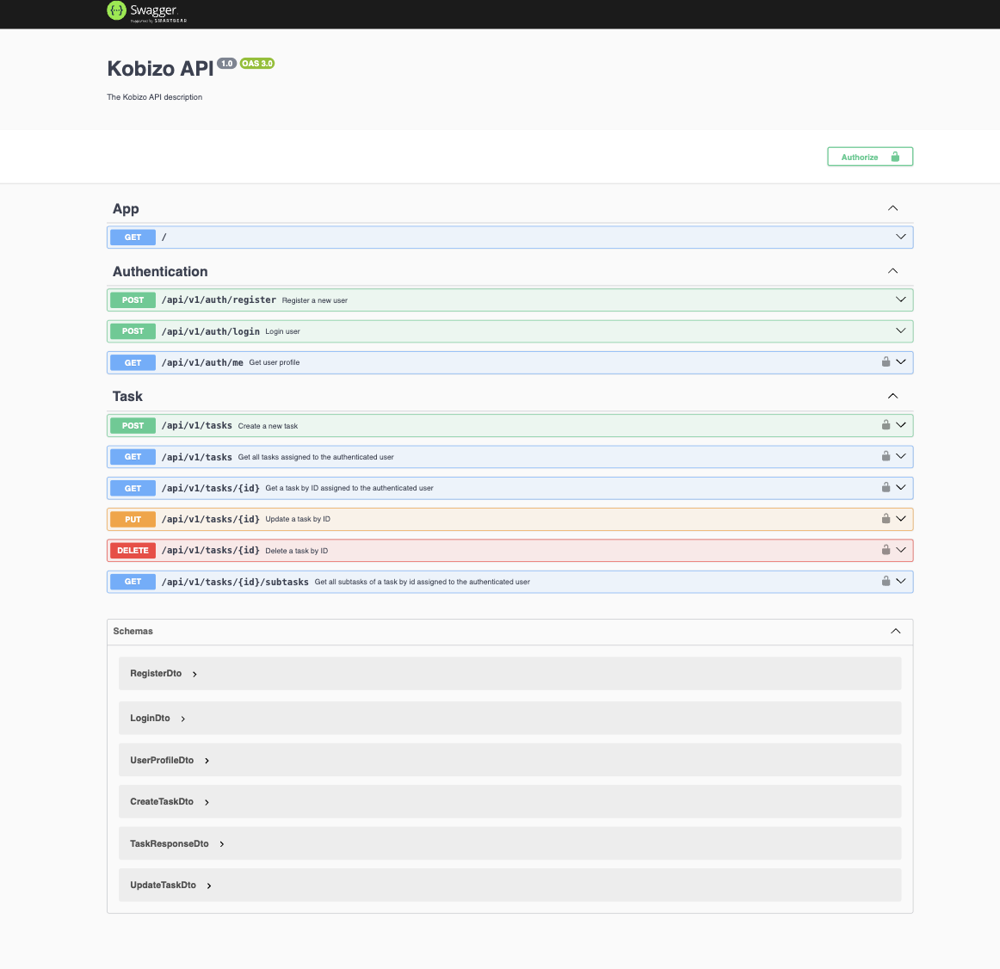

# Kobizo API

Kobizo API is a backend service built with NestJS, providing authentication and task management functionalities using Supabase.

## Table of Contents

- [Kobizo API](#kobizo-api)
  - [Table of Contents](#table-of-contents)
  - [Installation](#installation)
  - [Configuration](#configuration)
    - [Run this command to login to your Supabase project:](#run-this-command-to-login-to-your-supabase-project)
    - [Run this command to link to your Supabase project:](#run-this-command-to-link-to-your-supabase-project)
    - [Run this command to push your Supabase changes to remote (like migration files):](#run-this-command-to-push-your-supabase-changes-to-remote-like-migration-files)
    - [Run this command to create new migration file (optional if u wanna change table structure):](#run-this-command-to-create-new-migration-file-optional-if-u-wanna-change-table-structure)
  - [Running the Application](#running-the-application)
  - [API Documentation](#api-documentation)
  - [Testing](#testing)
  - [Contributing](#contributing)
  - [License](#license)

## Installation

1. **Clone the repository:**

   ```bash
   git clone https://github.com/buinguyet/kobizo_code_challenge.git
   cd kobizo_code_challenge
   ```

2. **Install dependencies:**

   ```bash
   npm install
   ```

## Configuration

1. **Environment Variables:**

   Create a `.env` file in the root directory and configure the following environment variables:

   ```plaintext
   SUPABASE_URL=your_supabase_url
   SUPABASE_ANON_KEY=your_supabase_anon_key
   SUPABASE_PROJECT_REF=your_supabase_project_id
   PORT=9999
   ```

   This required you to create project in Supabase and have some knowledge about it.
   If you don't want to create a new project, then let's use mine in *.env.example* file.

2. **Supabase Setup (If you want to use your own Supabase project):**
   Ensure your Supabase project is set up with the necessary tables and authentication configurations.

   ### Run this command to login to your Supabase project:
   ```bash
   npm run supabase:login
   ```

   ### Run this command to link to your Supabase project:
   ```bash
   npm run supabase:link
   ```

   ### Run this command to push your Supabase changes to remote (like migration files):
   ```bash
   npm run supabase:db:push
   ```

   ### Run this command to create new migration file (optional if u wanna change table structure):
   ```bash
   npm run supabase:db:new
   ```


## Running the Application

1. **Start the application:**

   ```bash
   npm run start
   ```

2. **Access the application:**

   The server will run at `http://localhost:9999`. Swagger documentation is available at `http://localhost:9999/api`.

## API Documentation
Swagger documentation is available at `http://localhost:9999/api`.



The API documentation is available via Swagger. It provides detailed information about the available endpoints, request/response formats, and authentication requirements.

## Testing

1. **Run tests:**

   ```bash
   npm test
   ```

2. **Run tests with coverage:**

   ```bash
   npm run test:cov
   ```

## Contributing

Contributions are welcome! Please follow these steps:

1. Fork the repository.
2. Create a new branch for your feature or bugfix.
3. Commit your changes.
4. Push to your fork and submit a pull request.

## License

This project is licensed under the MIT License. See the [LICENSE](LICENSE) file for details.
